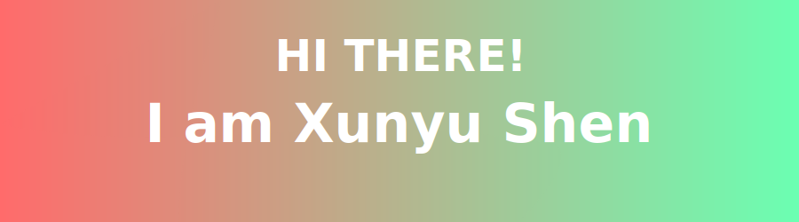
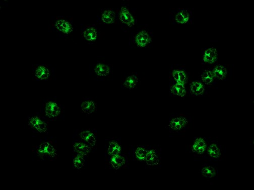

## Little About Me

I graduated from Pennsylvania State University in 2023 (We Are!!) where I was deeply involved in the machine learning. After graduation, I decided to pursue my Master's degree at Johns Hopkins University(Go Hop!). There, I shifted my focus to deep learnig - compyter vision. Throughout my academic journey and experience in data science and machine learning, my goal is to be an engineer who designs decision-making processes (feedback -> response).

## Ongoing research

I am leading an ongoing research project on automated detection of antineutrophil cytoplasmic antibody (ANCA) diseases using computer vision. Our team leverage a unique dataset of clinical patient slides from Johns Hopkins Hospital under special institutional authorization. The dataset includes high-resolution fluorescence images stained with HCHO and ethanol to highlight P-ANCA and C-ANCA patterns. My aim is to deliver a software tool that automates ANCA pattern detection in clinical workflows. This tool will assist pathologists by providing rapid, reliable screening—reducing workload and diagnostic variability. I plan to release a user-friendly interface and validate it in a Johns Hopkins clinical trial next year.

## Something That Is Not in My Resume

## Programming Languages

)

## Data Science & ML

